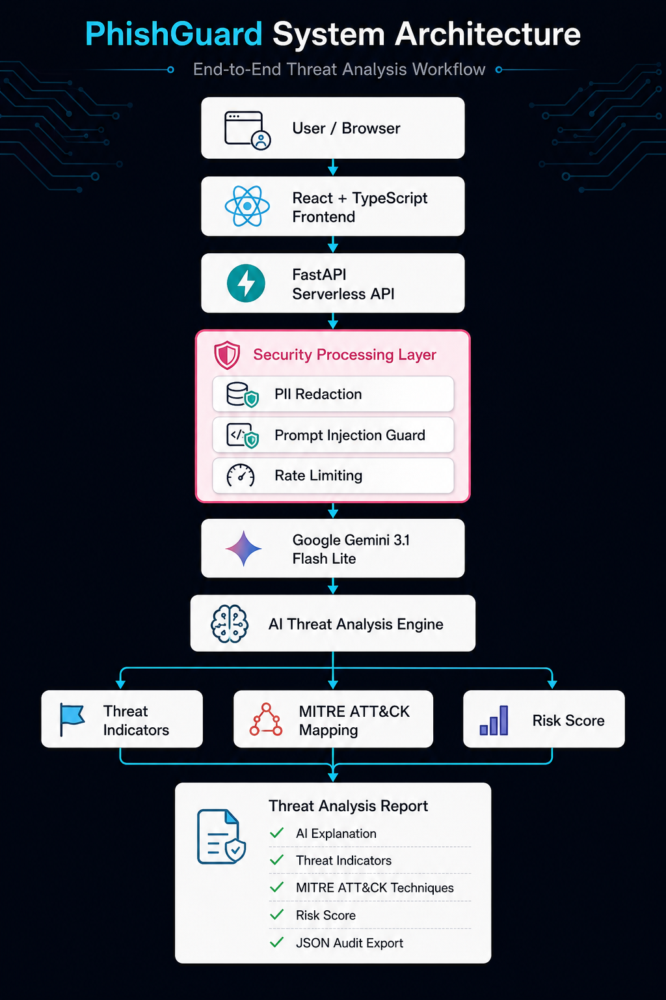
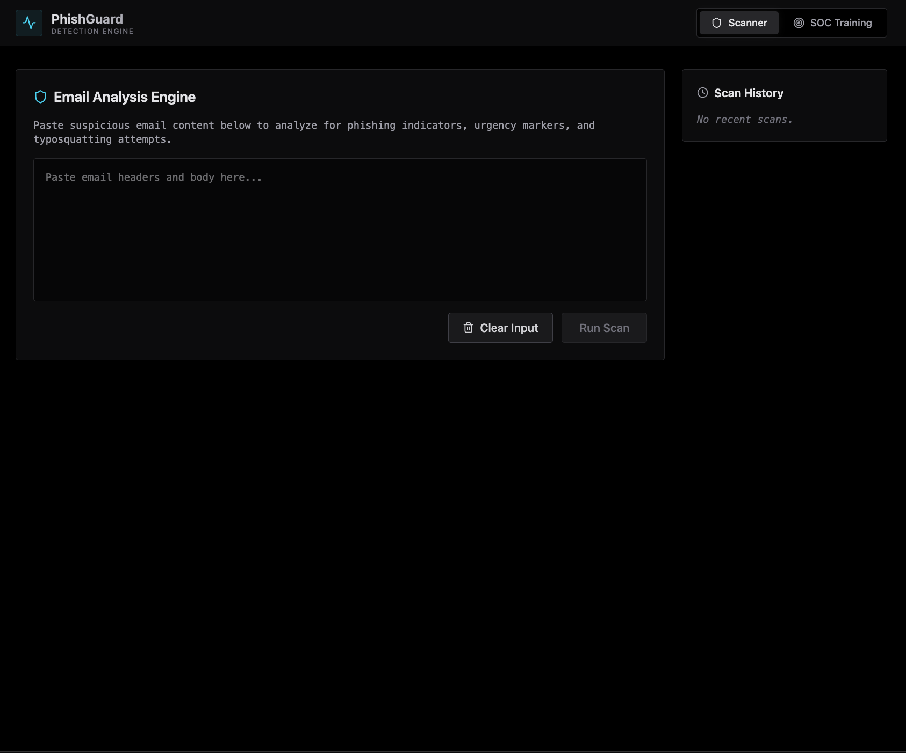
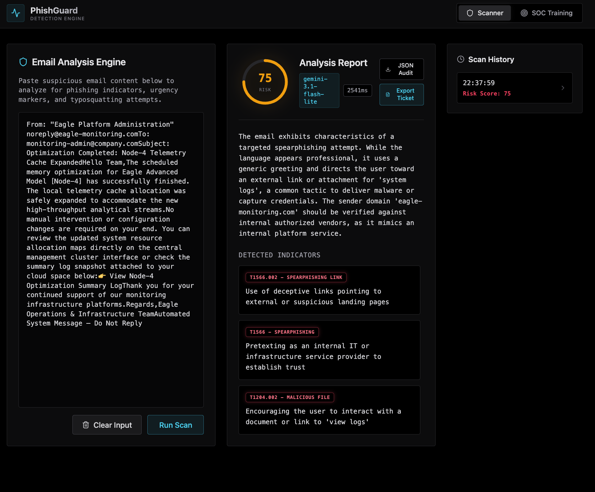
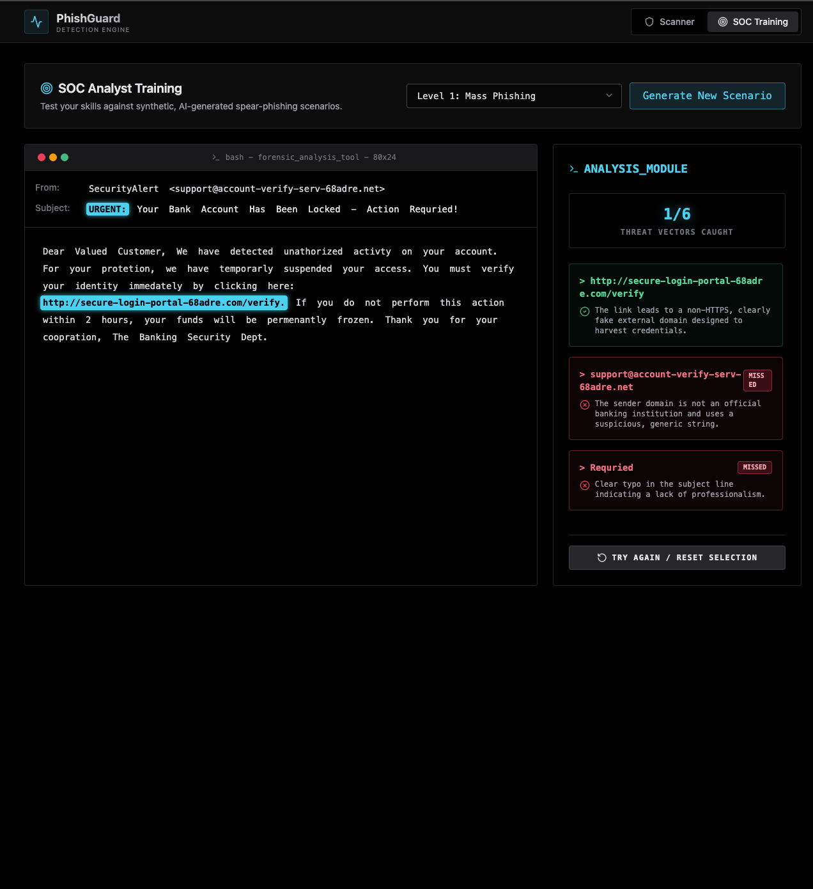

<p align="center">
  
</p>

<h1 align="center">🛡️ PhishGuard: AI Threat Detection Engine</h1>

<p align="center">
An AI-powered phishing detection and cybersecurity training platform built with React, FastAPI, and Google Gemini.
</p>

<p align="center">
  
  
  
  
  
  
  
</p>


<p align="center">

Featuring forensic email analysis, MITRE ATT&CK mapping, secure AI processing, and interactive SOC analyst training.

</p>
<p align="center">
<b>Status:</b> ✅ Feature Complete • Maintained as a portfolio and educational project.
</p>

---

# 🎥 Project Demo

<p align="center">
  
</p>

---

# 🏗️ System Architecture

<p align="center">
  
</p>

### Processing Workflow

```text
User
   │
   ▼
React + TypeScript Frontend
   │
   ▼
FastAPI Backend
   │
   ▼
Security Processing Layer
   ├── PII Redaction
   ├── Prompt Injection Protection
   └── Rate Limiting
   │
   ▼
Google Gemini 3.1 Flash Lite
   │
   ▼
AI Threat Analysis Engine
   │
   ├── Threat Indicators
   ├── MITRE ATT&CK Mapping
   ├── Risk Score
   ├── JSON Audit Export
   └── Incident Ticket
```

---

# 📸 Application Screenshots

## 🏠 Scanner Home

<p align="center">
  
</p>

The scanner accepts suspicious email content and performs AI-powered phishing analysis while maintaining secure request handling through backend preprocessing.

---

## 🔍 Analysis Report

<p align="center">
  
</p>

Each analysis includes:

- AI-generated threat explanation
- MITRE ATT&CK technique mapping
- Threat indicators
- Risk scoring
- JSON audit export
- Incident ticket generation

---

## 🎯 SOC Analyst Training

<p align="center">
  
</p>

The built-in SOC Training module generates realistic AI-powered phishing scenarios that allow analysts and students to practice identifying Indicators of Compromise (IOCs) and common social engineering techniques.

---

# ✨ Key Highlights

- 🛡️ AI-powered phishing email analysis using Google Gemini 3.1 Flash Lite
- 🎯 MITRE ATT&CK technique mapping for detected phishing indicators
- 🔒 PII redaction before AI processing
- 🧩 Prompt injection protection using structured input isolation
- 🚦 Backend rate limiting for safer API usage
- 📊 Risk score generation with AI explanation
- 📄 JSON audit export for forensic workflows
- 🎫 Incident ticket generation for SOC documentation
- 🎓 Interactive SOC analyst training with multiple phishing difficulty levels
- ⚡ Serverless deployment using FastAPI and Vercel

---

# 📌 Project Background

This project originated from a prototype generated using **Google AI Studio's Text-to-App** capability.

Rather than treating the generated application as a finished product, the objective was to transform it into a functional AI-powered cybersecurity application suitable for learning, demonstration, and portfolio purposes by debugging runtime issues, replacing deprecated components, integrating a secure FastAPI backend, improving the AI workflow, and deploying it as a publicly accessible web application.

The project also served as a practical learning experience in AI-assisted software development, backend integration, cybersecurity best practices, and cloud deployment.

---

## 👨‍💻 My Contributions

- ✅ Debugged and resolved runtime issues
- ✅ Refactored the generated codebase
- ✅ Updated deprecated Google Gemini model versions
- ✅ Integrated the FastAPI backend
- ✅ Configured Vercel Serverless deployment
- ✅ Added PII redaction and prompt injection protection
- ✅ Implemented backend rate limiting
- ✅ Improved project documentation
- ✅ Designed repository assets and architecture documentation

---

# 🛡️ Application Features

## 🔍 AI-Powered Email Analysis

- Detects phishing indicators
- Identifies urgency and social engineering techniques
- Detects typosquatting and impersonation attempts
- Generates AI-powered forensic explanations

---

## 🎯 MITRE ATT&CK Mapping

Maps detected phishing indicators to MITRE ATT&CK techniques, including examples such as:

- T1566 – Phishing
- T1566.001 – Spearphishing Attachment
- T1566.002 – Spearphishing Link
- T1204 – User Execution

---

## 🔒 Security Processing Layer

Every request passes through a dedicated security layer before reaching the language model.

Security features include:

- PII Redaction
- Prompt Injection Protection
- Backend Rate Limiting
- Input Validation

---

## 📄 Forensic Reporting

Automatically generates:

- Risk Score
- Threat Indicators
- AI Threat Explanation
- JSON Audit Export
- Incident Ticket Summary

---

## 🎓 SOC Analyst Training

Generate synthetic phishing scenarios across multiple difficulty levels:

- Level 1 — Mass Phishing
- Level 2 — Targeted Spear Phishing
- Level 3 — Executive BEC / Zero-Day

Designed for cybersecurity awareness, analyst training, and classroom demonstrations.

---

# 🛠️ Tech Stack

| Category | Technologies |
|----------|--------------|
| Frontend | React, TypeScript, Vite, Tailwind CSS |
| Backend | Python, FastAPI, Pydantic |
| AI | Google Gemini 3.1 Flash Lite |
| Infrastructure | Vercel Serverless Functions |
| Security | PII Redaction, Prompt Injection Protection, Rate Limiting |
| Standards | MITRE ATT&CK Framework |

---

# 💻 Local Development

## 1. Clone the Repository

```bash
git clone https://github.com/shreetejshinde2003/phishing-detection-engine.git

cd phishing-detection-engine
```

---

## 2. Install Backend Dependencies

```bash
pip install -r requirements.txt
```

---

## 3. Install Frontend Dependencies

```bash
npm install
```

---

## 4. Configure Environment Variables

Create a `.env` file in the project root.

```env
GEMINI_API_KEY=your_api_key_here
GEMINI_MODEL_VERSION=gemini-3.1-flash-lite
```

---

## 5. Run the Frontend

```bash
npm run dev
```

---

## 6. Run the Backend

```bash
uvicorn api.index:app --reload
```

---

After starting both the frontend and backend, open:

```
http://localhost:5173
```

---

# 🚀 Deployment

The application is optimized for deployment on **Vercel**.

Deployment architecture:

- React frontend built with Vite
- FastAPI backend deployed as Vercel Serverless Functions
- API routing configured using `vercel.json`
- Environment variables securely managed using Vercel

---

# 📂 Project Structure

```text
phishing-detection-engine/
│
├── api/                          # FastAPI backend
├── screenshots/                  # Documentation assets
│   ├── 00-banner.png
│   ├── 00-architecture.png
│   ├── demo.gif
│   └── ...
│
├── src/                          # React + TypeScript frontend
│
├── .env.example
├── package.json
├── requirements.txt
├── vercel.json
├── vite.config.ts
├── tsconfig.json
├── metadata.json
└── README.md
```

---

# 📚 What I Learned

Working on this project strengthened my practical understanding of:

- AI-assisted software development workflows
- Debugging AI-generated applications
- React and TypeScript development
- FastAPI backend integration
- Google Gemini API integration
- Secure API design
- Prompt injection mitigation
- PII sanitization techniques
- Serverless deployment with Vercel
- Git and GitHub version control
- Writing production-quality project documentation

---

# 📄 License

This project is protected under an **All Rights Reserved** license.

See the [LICENSE](LICENSE) file for complete copyright and usage terms.

## ⚠️ Disclaimer

PhishGuard is intended for educational, research, and cybersecurity awareness purposes only.

The phishing scenarios generated by this project are synthetic and are designed for defensive training and security education. Users are responsible for ensuring that any use of this software complies with applicable laws, regulations, and organizational policies.

---

## 👨‍💻 Author

**Shreetej Shinde**

- **GitHub:** <https://github.com/shreetejshinde2003>
- **Live Demo:** <https://phishing-detection-engine.vercel.app>

---

## ⭐ Support

If you found this project useful or interesting:

- ⭐ Star this repository
- 💬 Share the repository with others interested in AI and Cybersecurity

This project is feature-complete and maintained as a portfolio and educational project.

Bug reports and documentation suggestions are welcome.
